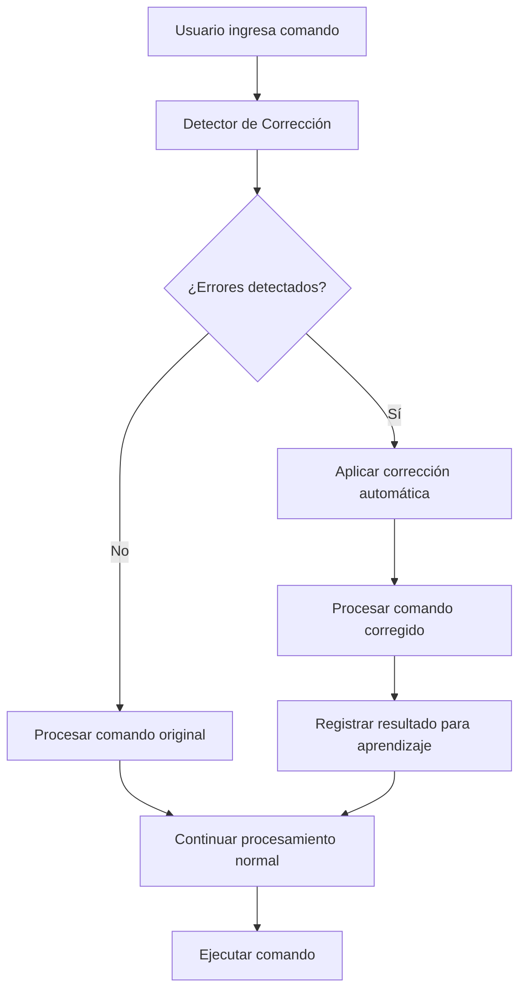

# 🔧 Guía del Sistema de Corrección Automática de Comandos - Roxy

## 📋 Descripción General

El **Sistema de Corrección Automática de Comandos** es una funcionalidad avanzada que detecta y corrige automáticamente errores en los comandos de voz y texto del usuario. Este sistema mejora significativamente la experiencia del usuario al:

- ✅ **Detectar errores tipográficos** automáticamente
- ✅ **Corregir problemas gramaticales** en español
- ✅ **Sugerir completaciones** para comandos incompletos
- ✅ **Aprender de correcciones** para mejorar con el tiempo
- ✅ **Integrarse transparentemente** con el sistema existente

## 🚀 Características Principales

### 1. 🔍 Detección de Errores Tipográficos
```python
# Ejemplos de correcciones automáticas:
"abre crome" → "abre chrome"
"reproduce spotifi" → "reproduce spotify"
"busca en youtuve" → "busca en youtube"
```

### 2. 📝 Corrección Gramatical
```python
# Correcciones gramaticales en español:
"pon el música" → "pon la música"
"abre la chrome" → "abre chrome"
"reproduces música" → "reproduce música"
```

### 3. 💡 Completación de Comandos
```python
# Sugerencias para comandos incompletos:
"reproduce" → "reproduce música", "reproduce en spotify"
"volumen" → "volumen arriba", "volumen abajo"
"abre" → "abre chrome", "abre spotify"
```

### 4. 🧠 Aprendizaje Automático
- **Registra correcciones exitosas** para mejorar futuras detecciones
- **Aprende patrones de usuario** específicos
- **Actualiza automáticamente** el diccionario de correcciones

## 🛠️ Instalación y Configuración

### Dependencias
```bash
pip install python-Levenshtein
```

### Integración Automática
El sistema se integra automáticamente cuando se inicializa `UnifiedCommandDetector`:

```python
from unified_command_detector import UnifiedCommandDetector

# El corrector se inicializa automáticamente
detector = UnifiedCommandDetector()
```

## 📖 Uso del Sistema

### 1. Corrección Automática Transparente
```python
# El usuario dice algo con errores:
user_input = "abre crome y reproduce musica"

# El sistema automáticamente:
# 1. Detecta errores: "crome" → "chrome", "musica" → "música"
# 2. Aplica corrección: "abre chrome y reproduce música"
# 3. Procesa el comando corregido
# 4. Registra el éxito para aprendizaje futuro

result = detector.analyze_command(user_input)
```

### 2. Obtener Sugerencias Manuales
```python
# Obtener sugerencias sin aplicar corrección
suggestions = detector.get_correction_suggestions("abre crome")

for suggestion in suggestions:
    print(f"Sugerencia: {suggestion['corrected']}")
    print(f"Tipo: {suggestion['type']}")
    print(f"Confianza: {suggestion['confidence']:.2f}")
    print(f"Explicación: {suggestion['explanation']}")
```

### 3. Registrar Correcciones Manuales
```python
# Registrar corrección manual para aprendizaje
success = detector.apply_manual_correction(
    original="comando original",
    corrected="comando corregido", 
    was_successful=True
)
```

### 4. Obtener Estadísticas
```python
# Ver estadísticas del sistema de corrección
stats = detector.get_correction_stats()
print(f"Correcciones totales: {stats['total_corrections']}")
print(f"Tasa de éxito: {stats['success_rate']:.2%}")
print(f"Patrones aprendidos: {stats['total_patterns']}")
```

## 🔧 Configuración Avanzada

### Personalizar Correcciones Comunes
```python
from automatic_command_corrector import AutomaticCommandCorrector

corrector = AutomaticCommandCorrector()

# Agregar nuevas correcciones comunes
corrector.common_corrections['nueva_app'] = ['nueva_ap', 'nueva_aap', 'nueva_app']
```

### Configurar Umbrales de Confianza
```python
# Ajustar umbral mínimo para corrección automática
# (por defecto: 0.8)
corrector.confidence_threshold = 0.7  # Más permisivo
```

### Personalizar Patrones de Comando
```python
# Agregar nuevos patrones de comando
corrector.command_type_patterns['custom'] = [
    r'\b(mi_comando|comando_especial)\b'
]
```

## 📊 Tipos de Corrección

### 1. **Corrección Tipográfica** (`typo`)
- **Descripción**: Corrige errores de escritura comunes
- **Método**: Distancia de Levenshtein + diccionario de correcciones
- **Confianza**: 0.7 - 1.0
- **Ejemplos**:
  - `crome` → `chrome`
  - `spotifi` → `spotify`
  - `youtuve` → `youtube`

### 2. **Corrección Gramatical** (`grammar`)
- **Descripción**: Corrige errores gramaticales en español
- **Método**: Patrones de regex específicos
- **Confianza**: 0.8
- **Ejemplos**:
  - `pon el música` → `pon la música`
  - `abres spotify` → `abre spotify`

### 3. **Completación de Comando** (`completion`)
- **Descripción**: Sugiere completaciones para comandos incompletos
- **Método**: Patrones de comandos conocidos
- **Confianza**: 0.6 - 0.8
- **Ejemplos**:
  - `reproduce` → `reproduce música`
  - `volumen` → `volumen arriba`

### 4. **Alternativa de Patrón** (`alternative`)
- **Descripción**: Sugiere alternativas basadas en patrones exitosos
- **Método**: Análisis de similitud con comandos exitosos previos
- **Confianza**: Variable según historial
- **Ejemplos**: Basado en patrones aprendidos del usuario

## 🎯 Integración con el Sistema Existente

### Flujo de Corrección Automática



### Integración con Memoria Conversacional
- Las correcciones se registran en la memoria para contexto futuro
- El sistema aprende de interacciones exitosas
- Se mantiene historial de correcciones para análisis

### Integración con Validación Pre-ejecución
- Las correcciones pasan por validación antes de ejecutarse
- Se mantiene trazabilidad del comando original
- Los errores de validación se registran para aprendizaje

## 🧪 Testing y Demostración

### Ejecutar Demo Completo
```bash
python demo_correccion_automatica.py
```

### Ejecutar Tests Específicos
```bash
# Test del sistema de corrección integrado
python unified_command_detector.py correction

# Test del corrector independiente
python automatic_command_corrector.py
```

### Casos de Prueba Incluidos
1. **Errores tipográficos**: "abre crome", "reproduce spotifi"
2. **Problemas gramaticales**: "pon el música", "abres spotify"
3. **Comandos incompletos**: "reproduce", "volumen"
4. **Comandos complejos**: Frases más largas con múltiples errores

## 📈 Métricas y Monitoreo

### Estadísticas Disponibles
- **Total de correcciones**: Número total de correcciones aplicadas
- **Correcciones exitosas**: Correcciones que resultaron en comandos válidos
- **Tasa de éxito**: Porcentaje de correcciones exitosas
- **Patrones aprendidos**: Número de patrones de comando aprendidos
- **Correcciones comunes**: Tamaño del diccionario de correcciones

### Archivos de Datos
- `command_corrections.json`: Datos de aprendizaje del corrector
- `learning_data.json`: Datos del sistema de aprendizaje general
- `conversation_memory.json`: Memoria conversacional con correcciones

## 🔮 Funcionalidades Futuras

### En Desarrollo
- [ ] **Corrección contextual avanzada**: Usar contexto de conversación
- [ ] **Integración con TTS**: Pronunciación correcta de correcciones
- [ ] **API de corrección externa**: Integración con servicios de corrección
- [ ] **Corrección multiidioma**: Soporte para inglés y otros idiomas

### Mejoras Planificadas
- [ ] **UI para gestión de correcciones**: Interfaz para revisar y aprobar correcciones
- [ ] **Exportación de estadísticas**: Informes detallados de rendimiento
- [ ] **Corrección colaborativa**: Aprendizaje de múltiples usuarios
- [ ] **Integración con IA avanzada**: Uso de modelos de lenguaje para corrección

## 🤝 Contribución

### Reportar Problemas
Si encuentras errores de corrección o tienes sugerencias:

1. Documenta el comando original y la corrección esperada
2. Incluye el contexto de uso
3. Proporciona ejemplos específicos

### Agregar Nuevas Correcciones
```python
# Ejemplo de cómo contribuir nuevas correcciones
corrector.common_corrections.update({
    'nueva_aplicacion': ['nueva_ap', 'nueva_apl', 'neuva_aplicacion'],
    'comando_especial': ['comando_especal', 'comand_especial']
})
```

## 📞 Soporte

Para soporte técnico o preguntas sobre el sistema de corrección automática:

- 📧 Contacto: Documentado en el repositorio principal
- 📚 Documentación adicional: Ver otros archivos GUIA_*.md
- 🐛 Reportar bugs: Sistema de issues del repositorio

---

**🎉 ¡El Sistema de Corrección Automática hace que Roxy sea aún más inteligente y fácil de usar!**
