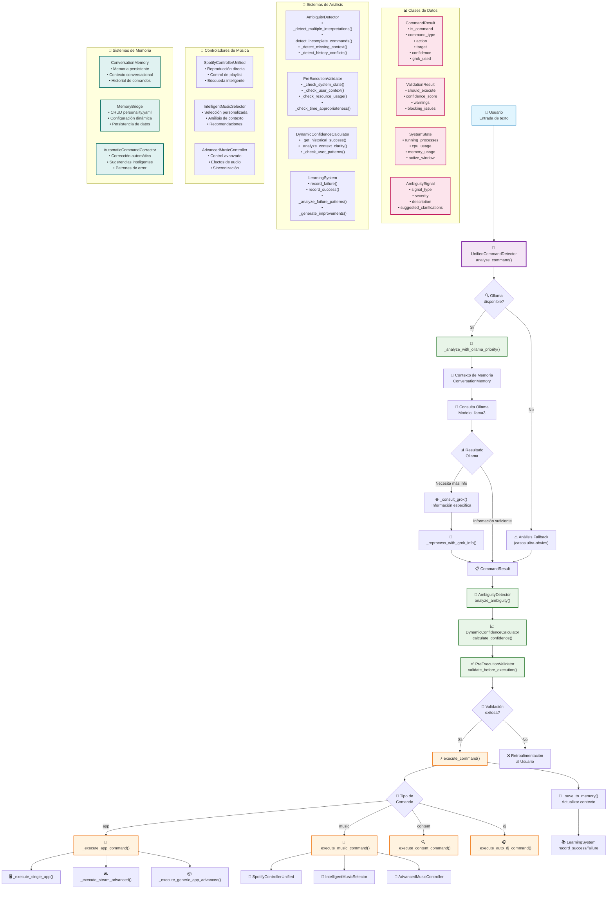

# 🤖 Roxy Megurdy - Asistente Virtual Inteligente

Un asistente virtual avanzado con capacidades de reconocimiento de voz, control de música, y sistema de comandos unificado.

## ✨ Características Principales

### 🧠 Sistema Inteligente Unificado
- **Detector Unificado**: Un solo sistema para todos los comandos
- **IA Híbrida**: Combinación de Llama3 (local) + Grok (cloud)
- **Aprendizaje Automático**: Mejora basándose en errores y patrones de uso
- **Memoria Conversacional**: Recuerda contexto y preferencias del usuario

### 🎵 Control Musical Avanzado
- **Spotify Integration**: Control completo de reproducción
- **Modo DJ Automático**: Selección inteligente de música
- **Análisis de Contexto**: Entiende el mood y situación
- **Historial Musical**: Aprende de tus gustos musicales

### 🎤 Sistema de Voz Mejorado
- **Reconocimiento de Voz**: Procesamiento inteligente de comandos hablados
- **Text-to-Speech**: Respuestas con voz natural usando ElevenLabs
- **Filtros Inteligentes**: Reducción de ruido y mejora de precisión

### 🔧 Funcionalidades del Sistema
- Control de aplicaciones (Chrome, Spotify, etc.)
- Búsqueda de contenido en YouTube, Google
- Ajuste de volumen del sistema
- Comandos en español y spanglish

## 🚀 Instalación y Uso

### Requisitos Previos
- Python 3.8 o superior
- Ollama instalado (para Llama3)
- Micrófono funcional (opcional)
- Cuentas API (opcionales pero recomendadas):
  - ElevenLabs (para text-to-speech)
  - Grok API (para IA avanzada)
  - Spotify Premium (para control musical)

### Instalación

1. **Clonar el repositorio**
   ```bash
   git clone https://github.com/tu-usuario/asistente-virtual.git
   cd asistente-virtual
   ```

2. **Instalar dependencias**
   ```bash
   pip install -r requirements.txt
   ```

3. **Configurar variables de entorno** (crear archivo `.env`)
   ```env
   # Opcional: API de Grok para IA avanzada
   grok_api_key=tu_grok_api_key_aqui
   
   # Opcional: ElevenLabs para text-to-speech
   ELEVENLABS_API_KEY=tu_elevenlabs_api_key_aqui
   ELEVENLABS_VOICE_ID=tu_voice_id_aqui
   ```

4. **Instalar y configurar Ollama**
   ```bash
   # Instalar Ollama desde https://ollama.ai
   ollama pull llama3:latest
   ```

### Inicio Rápido

**Método 1: Inicio automático (recomendado)**
```bash
python iniciar_sistema_completo.py
```

**Método 2: Solo el bot**
```bash
python bot_roxy_unified.py
```

## 🎯 Ejemplos de Uso

### Comandos de Música
- "Pon música de Bad Bunny"
- "Activa el modo DJ"
- "Salta a la siguiente canción"
- "Pon algo de música que voy a estudiar"

### Control de Aplicaciones
- "Abre Chrome"
- "Abre Spotify"
- "Busca en YouTube videos de gatos"

### Conversación General
- "¿Cómo estás Roxy?"
- "¿Qué puedes hacer?"
- "Cuéntame un chiste"

## 📁 Estructura del Proyecto

```
├── bot_roxy_unified.py           # Bot principal unificado
├── unified_command_detector.py   # Sistema de detección de comandos
├── iniciar_sistema_completo.py   # Iniciador automático
├── personality_config.py         # Configuración de personalidad
├── enhanced_voice_system.py      # Sistema de voz mejorado
├── advanced_music_controller.py  # Controlador musical avanzado
├── spotify_controller_unified.py # Controlador de Spotify
├── intelligent_memory_manager.py # Gestión de memoria inteligente
├── requirements.txt              # Dependencias del proyecto
└── docs/                        # Documentación adicional
```

## 🛠️ Configuración Avanzada

### APIs Opcionales

**ElevenLabs (Text-to-Speech)**
- Registrarse en [ElevenLabs](https://elevenlabs.io)
- Obtener API key y Voice ID
- Configurar en archivo `.env`

**Grok API (IA Avanzada)**
- Obtener acceso a Grok API
- Configurar `grok_api_key` en `.env`

**Spotify Premium**
- Crear app en [Spotify Developer](https://developer.spotify.com)
- Configurar credenciales (se hace automáticamente en primer uso)

## 🔧 Desarrollo

### 📊 Arquitectura del Sistema

El corazón del sistema es el `UnifiedCommandDetector`, que integra múltiples componentes de IA y procesamiento:



### 🏗️ Componentes Principales

#### 🎯 UnifiedCommandDetector
- **Análisis Inteligente**: Usa Ollama/LLaMA3 como motor principal de análisis
- **Integración Grok**: Consulta externa para comandos complejos
- **Validación Multi-Capa**: Sistema robusto de validación pre-ejecución
- **Memoria Conversacional**: Mantiene contexto entre interacciones

#### 🧠 Sistemas de IA y Análisis
- **AmbiguityDetector**: Detecta comandos ambiguos o incompletos
- **DynamicConfidenceCalculator**: Calcula confianza basada en múltiples factores
- **PreExecutionValidator**: Valida seguridad y viabilidad antes de ejecutar
- **LearningSystem**: Aprende de éxitos y fallos para mejorar continuamente

#### 🎵 Controladores Especializados
- **SpotifyControllerUnified**: Control directo de Spotify con API
- **IntelligentMusicSelector**: Selección inteligente basada en contexto
- **AdvancedMusicController**: Control avanzado con efectos y sincronización

#### 💾 Gestión de Memoria y Estado
- **ConversationMemory**: Memoria persistente entre sesiones
- **MemoryBridge**: Gestión dinámica de configuración
- **AutomaticCommandCorrector**: Corrección automática de comandos

### Características Técnicas
- **Sistema Unificado**: Un solo detector para todos los comandos
- **IA Híbrida**: Llama3 local + Grok cloud para máxima eficiencia
- **Modular**: Componentes independientes y reutilizables
- **Extensible**: Fácil agregar nuevas funcionalidades

### 🧠 Sistema de Memoria Inteligente

El asistente virtual cuenta con un sistema de memoria sofisticado que aprende y se adapta al usuario:

```mermaid
graph TB
    %% User Interaction Entry Point
    User["👤 Usuario<br/>Interacción"] --> MemoryEntry["🎯 Entrada de Memoria<br/>Nueva información"]
    
    %% Main Memory Flow
    MemoryEntry --> ConvMem["🧠 ConversationMemory<br/>Memoria Conversacional"]
    MemoryEntry --> MemBridge["🌉 MemoryBridge<br/>Filtro Inteligente"]
    
    %% ConversationMemory Internal Structure
    ConvMem --> ConvHist["📚 Historial Conversacional<br/>• conversation_history<br/>• max_history: 1000<br/>• deque structure"]
    ConvMem --> UserPrefs["❤️ Preferencias Usuario<br/>• user_preferences<br/>• UserPreference objects<br/>• category, frequency, confidence"]
    ConvMem --> RecentAct["🕐 Acciones Recientes<br/>• recent_actions<br/>• max 50 entries<br/>• deque structure"]
    ConvMem --> FailedCmd["❌ Comandos Fallidos<br/>• failed_commands<br/>• FailedCommand objects<br/>• retry tracking"]
    ConvMem --> SessionCtx["🎭 Contexto de Sesión<br/>• current_mood<br/>• active_apps<br/>• music_preference<br/>• conversation_topic"]
    
    %% ConversationMemory Statistics
    ConvMem --> CmdPatterns["📊 Patrones de Comando<br/>• command_patterns<br/>• time_patterns<br/>• success_rates"]
    
    %% MemoryBridge Processing
    MemBridge --> HeuristicFilter["🔍 Filtro Heurístico<br/>_is_potential_fact()"]
    HeuristicFilter --> OllamaAnalysis["🤖 Análisis Ollama<br/>LLaMA3 Decision"]
    OllamaAnalysis --> ConflictRes["⚖️ Resolución Conflictos<br/>_resolve_conflicts()"]
    ConflictRes --> Cooldown["⏰ Cooldown & Deduplicación<br/>_cooldown_and_dedupe()"]
    Cooldown --> PersonalityUpdate["📝 Actualización<br/>PersonalityConfig"]
    
    %% PersonalityConfig Structure
    PersonalityUpdate --> PersonalityYAML["📄 personality.yaml<br/>Configuración Persistente"]
    PersonalityYAML --> DefaultConfig["🔧 Configuración Base<br/>• usuario (nombre, edad, ubicación)<br/>• bot (personalidad, relación)<br/>• intereses (anime, juegos)<br/>• música (géneros, artistas)"]
    PersonalityYAML --> UsageMeta["📈 Metadatos de Uso<br/>• _usage_meta<br/>• count, last_used<br/>• relevance tracking"]
    PersonalityYAML --> ProtectedKeys["🛡️ Claves Protegidas<br/>• _protected_keys<br/>• información crítica<br/>• no se olvida automáticamente"]
    
    %% Intelligent Memory Manager
    MemoryEntry --> IntMemMgr["🧠 IntelligentMemoryManager<br/>MemoryManager"]
    IntMemMgr --> ConvRelevance["🎯 Análisis de Relevancia<br/>analyze_conversation_relevance()"]
    ConvRelevance --> MemoryFiltering["🔍 Filtrado Inteligente<br/>filter_memory_for_context()"]
    MemoryFiltering --> ContextOpt["⚡ Optimización Contexto<br/>optimize_context_for_grok()"]
    
    %% Learning System Integration
    ConvMem --> LearningSystem["📚 LearningSystem<br/>learning_data.json"]
    LearningSystem --> FailurePatterns["❌ Patrones de Fallo<br/>• failure_patterns<br/>• error categorization<br/>• improvement analysis"]
    LearningSystem --> SuccessPatterns["✅ Patrones de Éxito<br/>• success_patterns<br/>• command optimization<br/>• user behavior learning"]
    LearningSystem --> ImprovementHist["📈 Historial Mejoras<br/>• improvement_history<br/>• system evolution<br/>• adaptive learning"]
    
    %% External Data Sources
    ConvMem --> MemoryFile["💾 conversation_memory.json<br/>Persistencia Local"]
    PersonalityYAML --> YAMLFile["💾 personality.yaml<br/>Configuración Externa"]
    LearningSystem --> LearningFile["💾 learning_data.json<br/>Datos de Aprendizaje"]
    
    %% Ollama Integration
    OllamaAnalysis --> OllamaServer["🤖 Ollama/LLaMA3<br/>Local AI Processing"]
    ConvRelevance --> OllamaServer
    
    %% Memory Operations
    subgraph "🔄 Operaciones de Memoria"
        MemOps["Operaciones CRUD<br/>• create: nuevos hechos<br/>• replace: actualizar existentes<br/>• append: agregar a listas<br/>• delete: remover obsoletos"]
        Validation["Validación<br/>• cooldown (5 min)<br/>• max 2 ops/turno<br/>• deduplicación<br/>• conflict resolution"]
        Persistence["Persistencia<br/>• auto-save<br/>• thread-safe<br/>• backup/recovery<br/>• format validation"]
    end
    
    %% Data Structures
    subgraph "📊 Estructuras de Datos"
        ConvEntry["ConversationEntry<br/>• timestamp<br/>• user_input<br/>• command_result<br/>• response<br/>• success<br/>• context"]
        UserPref["UserPreference<br/>• category<br/>• preference_type<br/>• value<br/>• frequency<br/>• last_used<br/>• confidence"]
        FailedCmdStruct["FailedCommand<br/>• timestamp<br/>• user_input<br/>• attempted_action<br/>• error_reason<br/>• retry_count"]
    end
    
    %% Memory Strategies
    subgraph "🎯 Estrategias de Memoria"
        ConvStrategy["Conversational<br/>• contexto social<br/>• tono y personalidad<br/>• relación usuario-bot"]
        TechStrategy["Technical<br/>• comandos específicos<br/>• configuraciones<br/>• troubleshooting"]
        PersonalStrategy["Personal<br/>• preferencias usuario<br/>• datos personales<br/>• hábitos y patrones"]
        CasualStrategy["Casual<br/>• conversación libre<br/>• entretenimiento<br/>• interacciones ligeras"]
    end
    
    %% Memory Access Patterns
    ConvMem --> MemoryAccess["🔍 Acceso a Memoria"]
    MemoryAccess --> RecentContext["📖 Contexto Reciente<br/>get_recent_context()"]
    MemoryAccess --> RelevantHist["🎯 Historial Relevante<br/>get_relevant_history()"]
    MemoryAccess --> UserContext["👤 Contexto Usuario<br/>get_user_context()"]
    MemoryAccess --> SessionSummary["📋 Resumen Sesión<br/>get_session_summary()"]
    
    %% Integration with Main System
    RecentContext --> CommandDetector["🎯 UnifiedCommandDetector<br/>Análisis de comandos"]
    RelevantHist --> CommandDetector
    UserContext --> CommandDetector
    
    %% Memory Optimization
    ContextOpt --> GrokIntegration["🌐 Integración Grok<br/>Contexto optimizado"]
    MemoryFiltering --> ResponseGen["💬 Generación Respuestas<br/>Contexto filtrado"]
    
    %% Styling
    classDef userClass fill:#e1f5fe,stroke:#0277bd,stroke-width:2px
    classDef memoryClass fill:#f3e5f5,stroke:#7b1fa2,stroke-width:3px
    classDef storageClass fill:#e8f5e8,stroke:#2e7d32,stroke-width:2px
    classDef processClass fill:#fff3e0,stroke:#ef6c00,stroke-width:2px
    classDef dataClass fill:#fce4ec,stroke:#c2185b,stroke-width:2px
    classDef aiClass fill:#e0f2f1,stroke:#00695c,stroke-width:2px
    classDef integrationClass fill:#f1f8e9,stroke:#558b2f,stroke-width:2px
    
    class User userClass
    class ConvMem,MemBridge,IntMemMgr memoryClass
    class MemoryFile,YAMLFile,LearningFile,PersonalityYAML storageClass
    class HeuristicFilter,ConflictRes,Cooldown,MemoryFiltering,ContextOpt processClass
    class ConvEntry,UserPref,FailedCmdStruct,ConvHist,UserPrefs,RecentAct dataClass
    class OllamaAnalysis,OllamaServer,ConvRelevance aiClass
    class CommandDetector,GrokIntegration,ResponseGen integrationClass
```



### 🧠 Componentes del Sistema de Memoria

#### 💾 **ConversationMemory** - Memoria Conversacional
- **Historial Persistente**: Mantiene hasta 1000 conversaciones con estructura de deque
- **Preferencias de Usuario**: Aprende y categoriza preferencias (música, apps, contenido)
- **Acciones Recientes**: Tracking de las últimas 50 acciones para contexto inmediato
- **Comandos Fallidos**: Análisis de errores para mejora continua
- **Contexto de Sesión**: Estado actual (mood, apps activas, tema de conversación)

#### 🌉 **MemoryBridge** - Filtro Inteligente
- **Filtrado Heurístico**: Identifica información factual vs comandos efímeros
- **Análisis con IA**: Usa LLaMA3 para decidir qué persistir
- **Resolución de Conflictos**: Maneja conflictos entre información nueva y existente
- **Sistema de Cooldown**: Evita spam de actualizaciones (5 min cooldown)
- **Actualización Inteligente**: Máximo 2 operaciones por turno

#### 📄 **PersonalityConfig** - Configuración Persistente
- **Archivo YAML**: Configuración externa editable (`personality.yaml`)
- **Datos Protegidos**: Información crítica que nunca se olvida
- **Metadatos de Uso**: Tracking de frecuencia y relevancia
- **Categorización**: Organiza información por categorías (usuario, bot, intereses, música)

#### 🧠 **IntelligentMemoryManager** - Gestor Inteligente
- **Análisis de Relevancia**: Determina qué conversaciones son relevantes
- **Filtrado Contextual**: Optimiza memoria para diferentes contextos
- **Estrategias Adaptativas**: 4 estrategias (conversational, technical, personal, casual)
- **Integración Grok**: Optimiza contexto para consultas externas

#### 📚 **LearningSystem** - Sistema de Aprendizaje
- **Patrones de Fallo**: Analiza errores para mejorar el sistema
- **Patrones de Éxito**: Optimiza comandos exitosos
- **Historial de Mejoras**: Evolución y adaptación del sistema
- **Aprendizaje Adaptativo**: Mejora continua basada en uso

### 🔄 Flujo de Memoria

1. **Captura**: Nueva información del usuario entra al sistema
2. **Filtrado**: MemoryBridge determina si es información persistible
3. **Análisis IA**: LLaMA3 analiza relevancia y categorización
4. **Persistencia**: Se guarda en ConversationMemory y personality.yaml
5. **Contexto**: Se integra al contexto para futuras interacciones
6. **Aprendizaje**: LearningSystem analiza patrones para mejoras

### 🎯 Estrategias de Memoria

- **Conversacional**: Contexto social, personalidad, relación usuario-bot
- **Técnica**: Comandos específicos, configuraciones, troubleshooting
- **Personal**: Preferencias, datos personales, hábitos y patrones
- **Casual**: Conversación libre, entretenimiento, interacciones ligeras

### Contribuir
1. Fork del repositorio
2. Crear rama para tu feature (`git checkout -b feature/nueva-funcionalidad`)
3. Commit de cambios (`git commit -am 'Agregar nueva funcionalidad'`)
4. Push a la rama (`git push origin feature/nueva-funcionalidad`)
5. Crear Pull Request

## 📝 Licencia

Este proyecto está bajo la Licencia MIT - ver el archivo [LICENSE](LICENSE) para detalles.

## 🤝 Soporte

Si tienes problemas o preguntas:
1. Revisa la documentación en `/docs`
2. Busca en los Issues existentes
3. Crea un nuevo Issue con detalles del problema

## 🎉 Agradecimientos

- [Ollama](https://ollama.ai) por el runtime de IA local
- [ElevenLabs](https://elevenlabs.io) por la síntesis de voz
- [Spotify](https://developer.spotify.com) por la API musical
- Comunidad open source por las librerías utilizadas

---

**¡Disfruta de tu asistente virtual Roxy Megurdy! 🚀**
